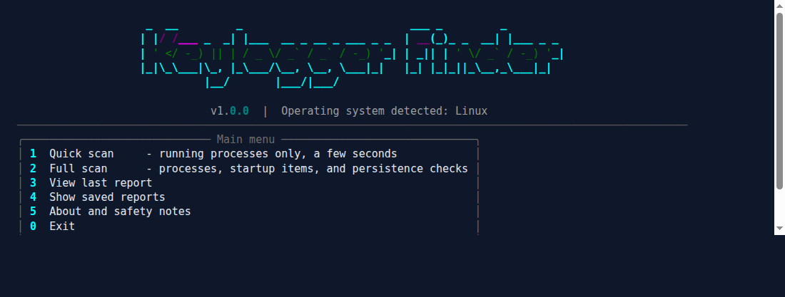
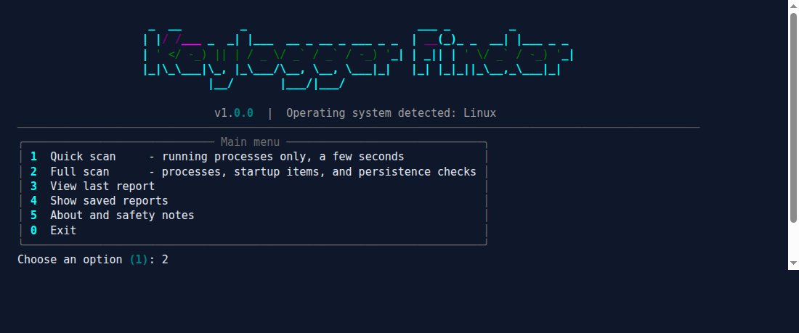
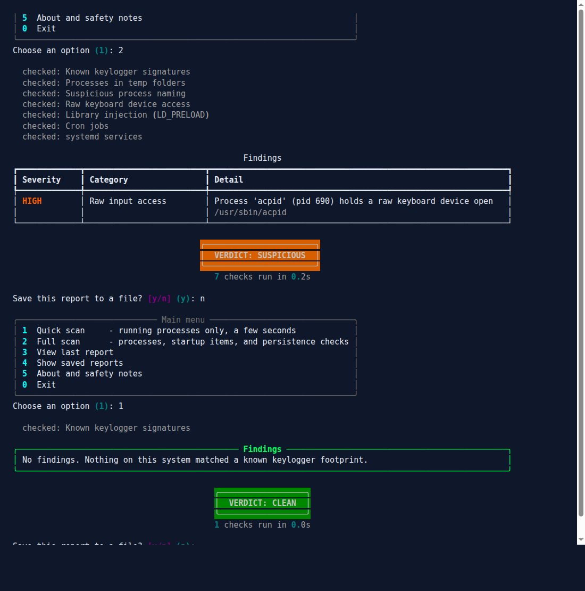
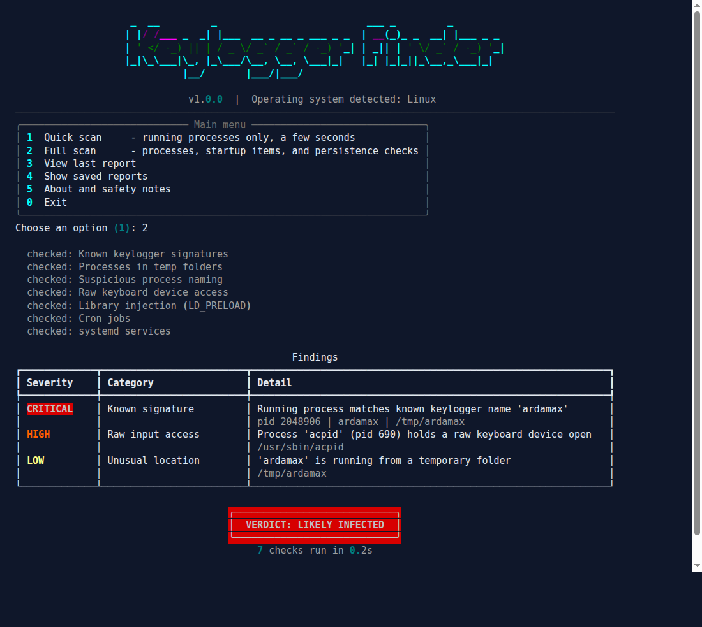
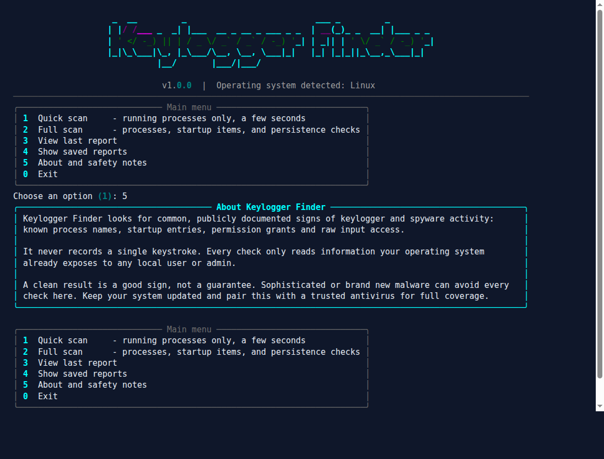
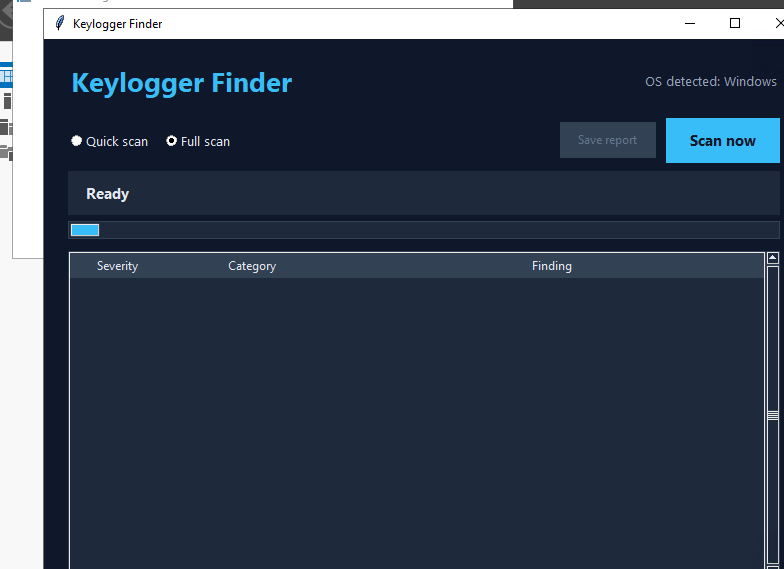

# 🛡️ Keylogger Finder

Keylogger Finder is a menu driven tool that checks your computer for common
signs of keylogger and spyware activity. It works on Windows, macOS, and
Linux. You can use it from a simple text menu (the CLI) or from a desktop
window (the GUI).

It is a detector, not a keylogger. It never records a single keystroke.
Every check only reads information your operating system already exposes
to any local user or admin, things like running process names, startup
entries, and permission grants.

## 🔍 What it looks for

* Processes that match public, known keylogger or spyware product names
* Processes running from odd places, like a temp folder
* Process names that mention words like "keylog" or "keystroke"
* Windows: registry Run keys, the Startup folder, and scheduled tasks
* macOS: LaunchAgents, LaunchDaemons, and Accessibility or Input Monitoring
  permission grants
* Linux: processes holding a raw keyboard device open, LD_PRELOAD library
  injection, cron jobs, and systemd services

Every finding gets a severity: info, low, medium, high, or critical. At the
end of a scan you get one plain verdict: CLEAN, MOSTLY CLEAN, SUSPICIOUS,
or LIKELY INFECTED.

A clean result is a good sign, not a guarantee. New or well hidden malware
can slip past any detector. Pair this tool with a trusted antivirus and
keep your system updated.

## 📸 Screenshots

**Main menu**



**The script running a scan**



**A quick scan result**



**Example of a scan that finds something**

This is a real, live scan. A harmless test file was planted under a known
keylogger name so you can see what a real detection looks like, without
needing an actually infected machine to test on. The tool genuinely found
it, the same way it would find the real thing.



**About screen**



**The desktop GUI, running on Windows**

Same detector, no terminal required. This is a genuine capture: a real
Windows machine, reached over RDP, running `python -m keylogger_finder.gui`.



## 🚀 Getting set up

You need Python 3.9 or newer.

```
cd "Keylogger Finder"
pip install -r requirements.txt
```

## ▶️ Running it

Start the text menu:

```
python run.py
```

or:

```
python -m keylogger_finder
```

Start the desktop window version:

```
python -m keylogger_finder.gui
```

The desktop window needs Tkinter. Windows and macOS already include it
with the normal Python installer from python.org. On Linux you may need
to add it first, for example `sudo apt install python3-tk` on Debian and
Ubuntu, or `sudo dnf install python3-tkinter` on Fedora.

## 🧭 Using the menu

1. Quick scan, checks running processes only, takes a few seconds
2. Full scan, adds startup items and persistence checks for your operating
   system
3. View last report, shows the result from your last scan again
4. Show saved reports, lists reports you chose to save earlier
5. About and safety notes
0. Exit

After a scan you can choose to save a report. Reports are saved as both a
JSON file and a plain text file inside the `reports` folder, named with the
date and time of the scan.

## 🧾 Understanding your verdict

* CLEAN, nothing was found at all
* MOSTLY CLEAN, only minor, low severity notes were found
* SUSPICIOUS, at least one medium or high severity finding, worth a closer
  look
* LIKELY INFECTED, a critical finding, or two or more high severity
  findings

## 🧪 Running the tests

```
python -m unittest discover -s tests -v
```

The test suite covers the scoring logic, the shared process checks, report
saving, and the full CLI menu end to end by actually running it and typing
into it. The Windows registry checks are tested with a stand in registry
so the logic can be checked on any operating system. The macOS launch
agent checks are tested with real sample files on disk.

## 📁 Project layout

```
Keylogger Finder/
  run.py                     starts the text menu
  requirements.txt
  keylogger_finder/
    cli.py                   the text menu
    gui.py                   the desktop window
    scanner.py                runs every check for your operating system
    report.py                 saves scan reports
    finding.py                 the data behind a finding and a verdict
    signatures.py               known names and suspicious words
    platforms/
      common_checks.py          checks that run on every operating system
      windows_checks.py
      macos_checks.py
      linux_checks.py
    ui/
      theme.py                colors and the banner
  screenshots/
  reports/
  tests/
```

## 🍎 A note on macOS

The macOS checks are covered by unit tests that build sample launch agent
files and a sample permissions database, since a real Mac was not
available while building this. The logic follows Apple's own documented
locations for these checks, but it has not been run on real macOS
hardware. If you run this on a Mac and something looks off, please open
an issue and let me know.

## 🔒 A note on privacy

This tool does not send anything anywhere. Every report stays on your own
computer inside the `reports` folder. There is no network activity at all
during a scan.
